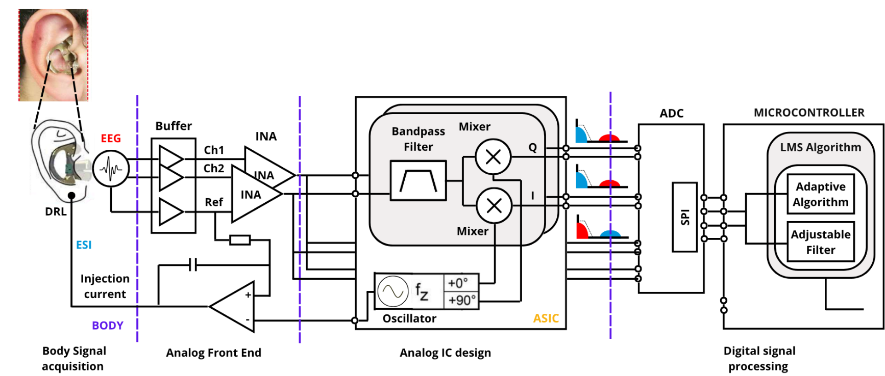

# CMOS ASIC for Simultaneous Electrode–Skin Impedance Measurement

- [Read the documentation for the project](docs/info.md)

---

# Project Overview

Bio-signal acquisition systems such as **EEG, ECG, and EMG** often suffer from **motion artifacts**, which degrade the quality of the recorded signals. Motion artifacts occur when there is **relative movement between the electrode and the skin**, causing variations in the **skin–electrode impedance**.

These impedance variations introduce **non-stationary distortions** into the recorded signal, which significantly affect downstream signal processing and analysis.

This project focuses on designing a **CMOS Application-Specific Integrated Circuit (ASIC)** capable of **simultaneously measuring electrode–skin impedance** while recording physiological signals. The measured impedance signal can then be used as a **reference input for adaptive filtering techniques** to suppress motion artifacts in EEG recordings.

---

# What are Motion Artifacts?

Motion artifacts are **unwanted, non-stationary distortions** that contaminate bio-signals due to:

- Movement of the subject
- Movement or displacement of electrodes
- Variations in the skin–electrode contact impedance

These artifacts often overlap with the frequency range of physiological signals, making them difficult to remove using conventional filtering techniques.

---

# Removing Motion Artifacts Using Impedance Measurement

Several methods exist to reduce motion artifacts in bio-signal acquisition systems. In this project, we utilize **skin–electrode impedance monitoring** as a reference signal.

The approach is as follows:

1. Inject a small **stimulation signal** into the electrode interface.
2. Measure the **in-phase (I)** and **quadrature (Q)** components of the impedance.
3. Use the measured impedance signal as a **reference input to an adaptive filter**.
4. Remove motion artifacts from the EEG signal through adaptive filtering.

---

# Impedance Measurement ASIC

The proposed ASIC measures the **in-phase and quadrature components of the electrode–skin impedance** while recording EEG signals.

The architecture consists of:

- Fully differential operational amplifiers
- Fully differential multipliers
- Active RC band-pass filters

These blocks allow extraction of impedance information from the electrode interface while maintaining **low noise and high signal fidelity**.

---

# Project Phases

The project is divided into **three major phases**.

---

# Phase 01 – Design and Tapeout of a Fully Differential Operational Amplifier

In the first phase, we designed a **fully differential operational amplifier (Op-Amp)** which serves as the **fundamental building block** for the ASIC.

This amplifier is reused in multiple modules including:

- Active filters
- Multipliers
- Signal conditioning stages

### Key Features

- Designed using the **Sky130 PDK**
- Fully differential architecture
- Includes **common-mode feedback (CMFB)** circuits
- Optimized for **low-frequency biomedical signal processing**

The design and simulations were completed successfully and the chip was **submitted for tapeout**.

Github Repository:

https://github.com/LohanAtapattu/ttsky25_EpitaXC

---

# Phase 02 – Fully Differential Multiplier Design and Layout

In the **second phase**, we focus on designing a **fully differential multiplier** optimized for:

- **Low-frequency biomedical signals**
- **Low power consumption**
- **High linearity**

The multiplier is required to extract the **I/Q components of the impedance signal**.

### Multiplier Architecture

The multiplier uses:

- A **four-MOSFET based multiplication core**
- A **fully differential operational amplifier**

This architecture provides:

- High linearity
- Efficient signal multiplication
- Low distortion

The design and layout are implemented using the **IHP 130nm BiCMOS (ihp13g2) PDK**.

This repository contains the **layout and verification files** intended for **tapeout submission through the UNIC-CASS 2026 program**.

---

# Phase 03 – Complete ASIC for Impedance Measurement

In the final phase, all designed building blocks will be integrated into a **single ASIC**.

The complete chip will include:

- **Two fully differential operational amplifiers**
- **Two fully differential multipliers**
- **Two-stage active RC band-pass filter**

The goal is to extract the **impedance mismatch signal** generated due to electrode motion.

The complete ASIC will be:

- Simulated using the **Sky130 PDK**
- Implemented with **full layout design**
- Verified using **Cadence design tools**

---

# Operational Amplifier Architecture

The operational amplifier follows a **two-stage architecture**:

1. **Folded Cascode Amplifier** (First Stage)
2. **Common Source Gain Stage** (Second Stage)

This architecture enables:

- High gain
- Improved phase margin
- Low noise performance
- Suitability for low-frequency biomedical applications

---

# Biasing Circuit

A **beta-multiplier reference bias circuit** is used to generate stable bias currents.

The biasing system includes:

- Beta multiplier current reference
- Startup circuit
- Bias distribution network

This ensures **stable operation across process and temperature variations**.

---

# Folded Cascode Operational Amplifier

The first stage uses a **folded cascode topology**, chosen for its:

- High gain
- High output impedance
- Good bandwidth characteristics

A **single-ended differential amplifier based CMFB circuit** regulates the output common-mode voltage.

---

# Common Source Gain Stage

The second stage is a **common source amplifier** used for gain enhancement.

A **resistor-based CMFB topology** is used to stabilize the output common-mode voltage.

---

# Operational Amplifier Specifications

| Parameter | Value 1 | Value 2 | Value 3 |
|---|---|---|---|
| Supply Voltage | 1.7 V | 1.8 V | 1.9 V |
| Input Common Mode Voltage | 0.85 V | 0.9 V | 0.95 V |
| Output Common Mode Voltage | 0.85 V | 0.9 V | 0.95 V |
| Temperature | 20°C | – | 50°C |
| PSRR | 170 dB | 180 dB | 190 dB |
| CMRR | 230 dB | 250 dB | 270 dB |
| Phase Margin | 50° | 60° | 70° |
| Gain Bandwidth Product | 800 kHz | 1 MHz | 1.2 MHz |
| Open Loop DC Gain | 80 dB | 100 dB | 120 dB |

---

# Simulation Setup

The following testbench was used for circuit simulations:

---

# Fully Differential Multiplier

The multiplier is implemented using a **fully differential operational amplifier-based topology** combined with a **four-MOSFET multiplication core**.

---

# Linearity Simulation

To evaluate the performance of the multiplier, **linearity testing** was performed using the following testbench.

### Linearity Testbench

### Linearity Results

---

# Final Objective

The final objective of this project is to develop a **low-power CMOS ASIC capable of simultaneously measuring electrode–skin impedance during EEG acquisition**.

The extracted impedance signal will enable **adaptive filtering techniques to remove motion artifacts**, improving the quality and reliability of biomedical signal acquisition systems.