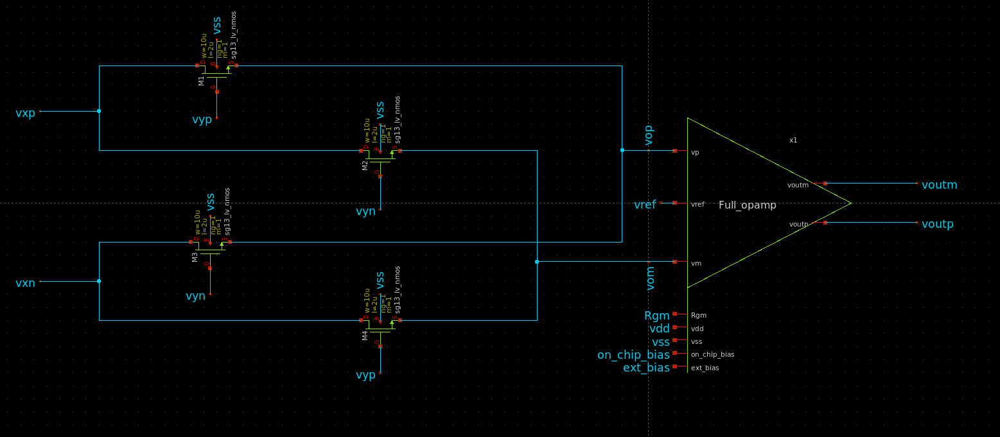
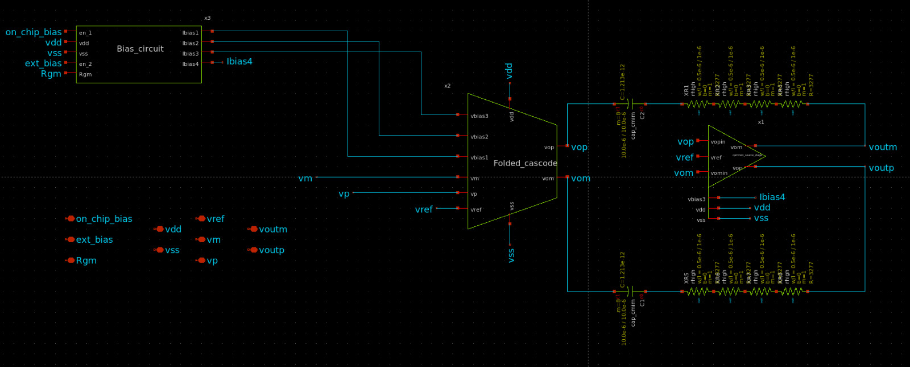
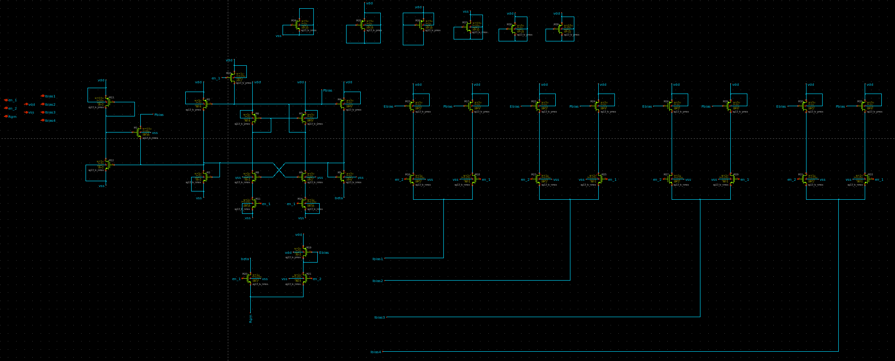
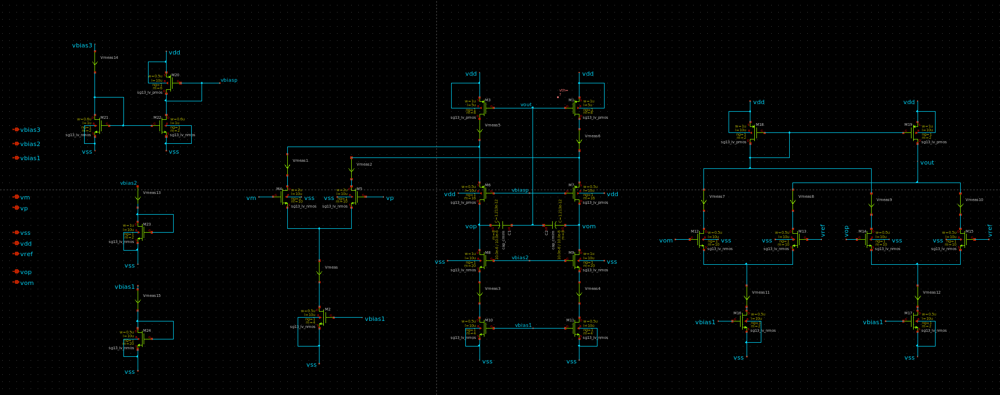
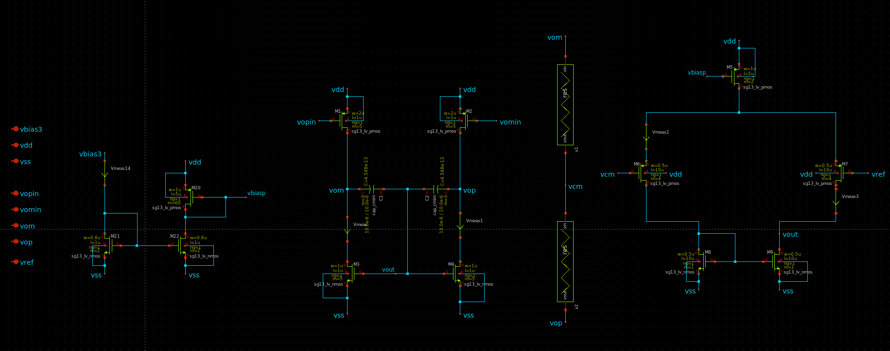
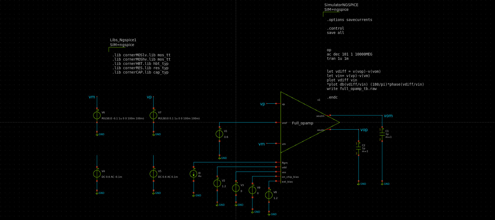
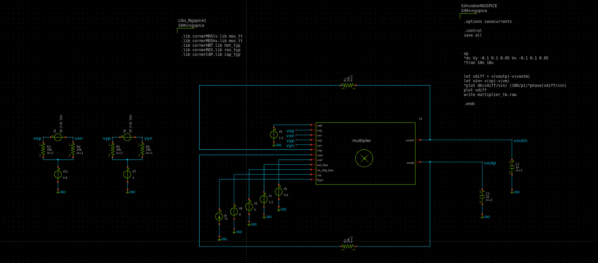
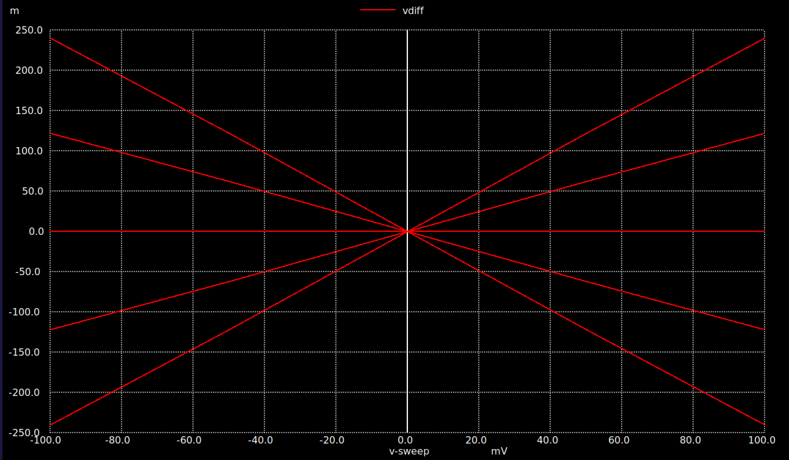

 

# CMOS ASIC for Simultaneous Electrode-Skin Impedance Measurement 

- [Read the documentation for project](docs/info.md)

## What are Motion Artifacts?

unwanted, nonstationary distortions that contaminate bio-signals due to movement of the subject or electrodes during recording

## Remove motion artifacts using impedance measurement 

There are various methods to remove motion artifacts. In this project, we expect to use adaptive filtering techniques, providing the skin–electrode impedance signal as a reference to filter out motion artifacts.

## Impedance mesuremnt ASIC

In this project, we will design and tape out an application-specific integrated circuit (ASIC) to obtain the in-phase and quadrature (I/Q) components of the skin–electrode impedance signal, stimulated by a body signal, while using the EEG signal as the input. The ASIC consists of two fully differential operational amplifiers for implementing an active RC band-pass filter, along with two fully differential multipliers.

## Project Phases  

### Phase 01 – Design and Tapeout of a Fully Differential Operational Amplifier  
In the first phase of the project, we will design a **fully differential operational amplifier (op-amp)**.  
This op-amp will serve as a fundamental building block that can be reused across all modules of the ASIC.  
The design and simulations will be carried out using the **Sky130 PDK**. We have already completed this phase of the project. Github link :- https://github.com/LohanAtapattu/ttsky25_EpitaXC

### Phase 02 – Design and Layout of the Fully Differencial multiplier for signal multiplication.
As the first phase of the project, we will design a **fully differential multiplier**.  op-amp serve as a fundamental building block for the multiplier and simulations and layout completed using ihp13g2 pdk. Expecting to tapeout using Unic Cass 2026 iteration.

### Phase 03 – Design and Layout of the ASIC for Impedance Measurement  
In the third phase, we will design the complete ASIC for **impedance measurement**.  
The chip will integrate:  
- two fully differential op-amps  
- two fully differential multipliers  

The design and layout will be implemented using the **Sky130 PDK** with candence tools.

#### Phase 02 – Design and Implementation of Fully Differential Multiplier 

##### Specifications for fully differencial operational amplifier

| Parameter                               | Value 1 | Value 2 | Value 3 |
|-----------------------------------------|---------|---------|---------|
| **Supply Voltage (Design Input)**       | 1.7 V   | 1.8 V   | 1.9 V   |
| **Common Mode Voltage (Design Input)**  | 0.85 V  | 0.9 V   | 0.95 V  |
| **Common Mode Voltage (Design Output)** | 0.85 V  | 0.9 V   | 0.95 V  |
| **Temperature (Design Input)**          | 20 °C   | –       | 50 °C   |
| **PSRR**                                | 170 dB  | 180 dB  | 190 dB  |
| **CMRR**                                | 230 dB  | 250 dB  | 270 dB  |
| **Phase Margin**                        | 50°     | 60°     | 70°     |
| **Gain Bandwidth Product**              | 800 kHz | 1 MHz   | 1.2 MHz |
| **Open Loop (low-freq) DC Gain**        | 80 dB   | 100 dB  | 120 dB  |

#### Project Architecture  

We expect to design a **two-stage operational amplifier** with a **common-source stage** as second stage for gain enhancement.  
For each stage, a **common-mode feedback (CMFB) circuit** is used to ensure stability and maintain the desired common-mode voltage throughout the design. For the multiplication we expect to use the four mosfet based architecture as in the below figure 

below is the block diagram and connections of the operational amplifier in Xschem 

##### Biasing Circuit  

We have employed a **beta-multiplier based biasing circuit** design with a **startup circuit**, as shown below:  

##### Operational Amplifier  

For the operational amplifier stage, we have employed a **folded cascode architecture**.  
Additionally, a **single-ended differential amplifier based common-mode feedback (CMFB) circuit** is used to maintain the common-mode voltage at a fixed reference level.  

##### Common Source Stage  

For the common source stage, we have used a **resistor-based common-mode feedback (CMFB) topology** to stabilize the output common-mode voltage.  

#### Simulations  

For the simulations, we have used the following testbench setup:  

##### Fully Differential Amplifier  

The fully differential amplifier design is the same as described above.  

##### Fully Differential Multiplier  

For the **fully differential multiplier** design, we have employed a **fully differential operational amplifier-based topology**, as shown below:  
g

##### Simulations  

###### Linearity  

The **linearity** of the circuit was tested, and the results are shown below:  

Above is the linearity testbench for the multiplier

 

